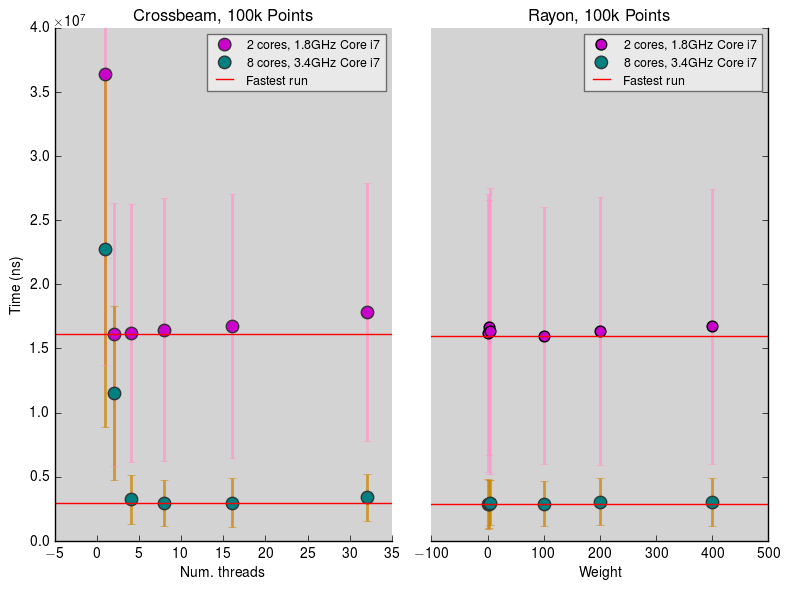

       

# Introduction

A Rust library with FFI bindings for fast conversion between WGS84 longitude and latitude and British National Grid ([epsg:27700](http://spatialreference.org/ref/epsg/osgb-1936-british-national-grid/)) coordinates, using a Rust binary. Conversions use a standard 7-element Helmert transform with the addition of OSTN15 corrections for [accuracy](#accuracy).

# Motivation
Python (etc.) is relatively slow; this type of conversion is usually carried out in bulk, so an order-of-magnitude improvement using FFI saves both time and energy.  
[Convertbng](https://github.com/urschrei/convertbng) is an example Python Wheel which uses this binary via `ctypes` and `cython`.

# Accuracy
Conversions which solely use Helmert transforms are accurate to within around 5 metres, and are **not suitable** for calculations or conversions used in e.g. surveying. Thus, we use the OSTN15 transform, which adjusts for local variation within the Terrestrial Reference Frame by incorporating OSTN15 data. [See here](http://www.ordnancesurvey.co.uk/business-and-government/help-and-support/navigation-technology/os-net/surveying.html) for more information.  

# Library Use
## As a Rust Library
Add the following to your `Cargo.toml` (the latest version is displayed on the fourth badge at the top of this screen)  

    lonlat_bng = "x.x.x"

Full library documentation is available [here](http://urschrei.github.io/lonlat_bng/)  

**Note that `lon`, `lat` coordinates outside the [UK bounding box](http://spatialreference.org/ref/epsg/27700/) will be transformed to `(NAN, NAN)`, which cannot be mapped.**  

The functions exposed by the library can be found [here](http://urschrei.github.io/lonlat_bng/lonlat_bng/index.html#functions)

## FFI
The FFI C-compatible functions exposed by the library are:  
`convert_to_bng_threaded(Array, Array) -> Array`  
`convert_to_lonlat_threaded(Array, Array) -> Array`  

`convert_to_osgb36_threaded(Array, Array) -> Array`  
`convert_to_etrs89_threaded(Array, Array) -> Array)`  
`convert_osgb36_to_ll_threaded(Array, Array) -> Array`  
`convert_etrs89_to_ll_threaded(Array, Array) -> Array`  

`convert_etrs89_to_osgb36_threaded(Array, Array) -> Array`  
`convert_osgb36_to_etrs89_threaded(Array, Array) -> Array`  

`convert_epsg3857_to_wgs84_threaded(Array, Array) -> Array`  

### FFI and Memory Management
The library does not allocate memory using new vectors or arrays; the longitude and latitude arrays you pass to it via FFI are converted into mutable [slices](https://doc.rust-lang.org/std/slice/) (an inherently [`unsafe`](https://doc.rust-lang.org/std/slice/fn.from_raw_parts_mut.html) operation), then mutated in-place before being passed back across the FFI boundary as C-compatible arrays. Thus, the calling code retains ownership of the allocated memory at all times – it is up to the calling program to ensure that the data passed to `lonlat_bng` live long enough, and are correctly freed (in practice, they will be freed automatically if using a dynamic language).

### Building the Shared Library
Running `cargo build --release` will build an artefact called `liblonlat_bng.dylib` on OSX, and `liblonlat_bng.a` on `*nix` systems. Note that you'll have to generate `liblonlat_bng.so` for `*nix` hosts using the following steps:

- `ar -x target/release/liblonlat_bng.a`
- `gcc -shared *.o -o target/release/liblonlat_bng.so -lrt` 

## As a Python Package
`convert_bng` is [available](https://pypi.python.org/pypi/convertbng/) from PyPI for OSX, Windows, and *nix:  
`pip install convertbng`  
More information is available in its [repository](https://github.com/urschrei/convertbng)

# Benchmark
A CProfile [benchmark](remote_bench.py) was run, comparing 50 runs of converting 1m random lon, lat pairs in NumPy arrays.

## Methodology
- 4 [Amazon EC2 C4](http://docs.aws.amazon.com/AWSEC2/latest/UserGuide/c4-instances.html) (compute-optimised) systems were tested
- The system was first calibrated by taking the mean of five calibration runs of 100,000 repeats
- A benchmark program was then run for each of the three configurations. See the [benches](benches) directory for details
- The five slowest function calls for each benchmark were then displayed.

## Results

| EC2 Instance Type    | Processors (vCPU) | Rust Ctypes (s) | Rust Cython (s) | Pyproj (s) | Ctypes vs Pyproj | Cython vs Pyproj |
|:----------|:----------:|:----------:|:----------:|:----------:|:----------:|----------:|
| c4.xlarge            | 4                 | 14.782          | 11.714          |  9.379     |   58.36%         |   24.97%         |
| c4.2xlarge           | 8                 | 8.647           | 6.421           |  9.256     |  -6.57%          |  -30.62%         |
| c4.4xlarge           | 16                | 6.470           | 3.716           |  9.398     |  -31.49%         |  -60.25%         |
| c4.8xlarge           | 36                | 4.913           | 2.501           |  9.308     |  -48.05%         |  -73.35%         |

## Conclusion
Rust is faster than PROJ.4 on an 8-CPU system – even using `ctypes` – and outperforms it by greater margins as the number of CPUs increase: at 36 CPUs, Rust + Cython is over 3.7x faster.

# Comparing Crossbeam and Rayon
Comparing how varying threads and weights affects overall speed, using [`cargo bench`](benches/benchmarks.rs)  
On both 2- and 8-core i7 machines, running `convert_bng_threaded_vec` using one thread per core gives optimum performance, whereas Rayon does a good job at choosing its own optimum weight.

# License
[MIT](license.txt)  

This software makes use of OSTN15 data, which is © Crown copyright, Ordnance Survey and the Ministry of Defence (MOD) 2016. All rights reserved. Provided under the BSD 2-clause [license](OSTN15_license.txt).
